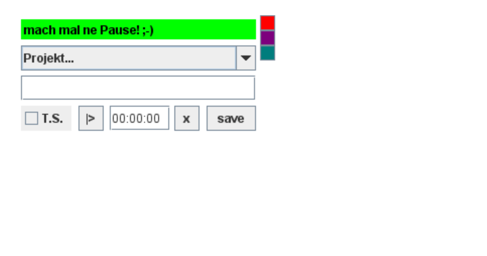

# Time Keeper

this little java tool helps keeping track of time spent on different Projects.

## how to use it

create a file called config.ini in the same folder as the main programme.
in this file a list of projects can be defined:
```
projects=poject01,project02,sampleProject,etcProject
```

* when launching Time Keeper there should be a list of the created projects
* after selecting a project the time can be tracked and a note can specify the task
* save will store the time and note in a csv file (each project will generate a seperate file)


